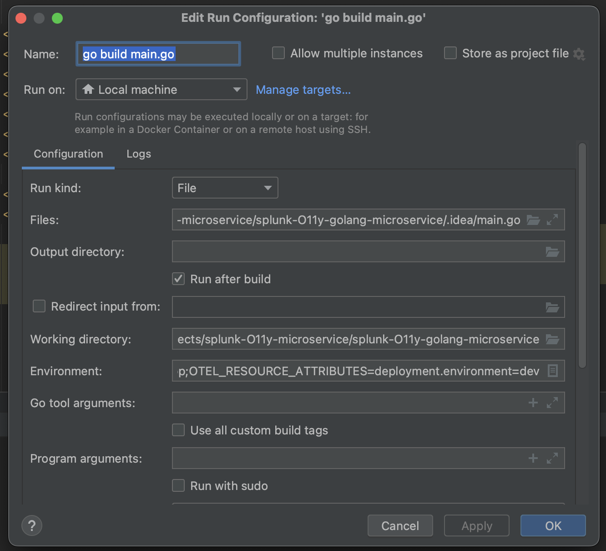
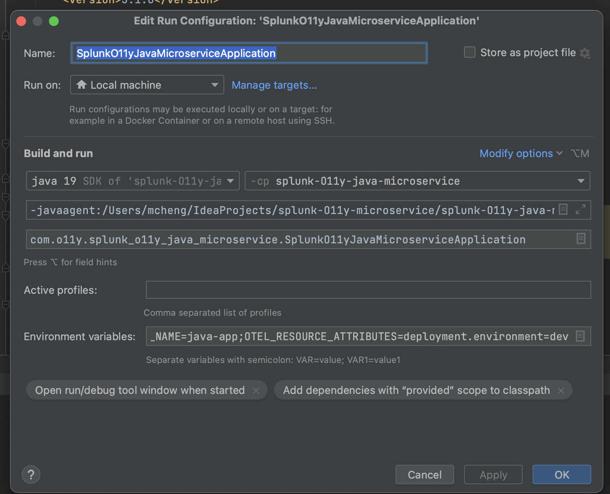
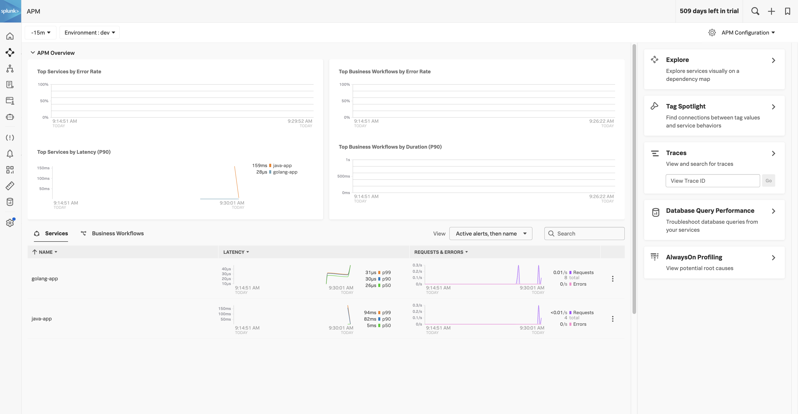
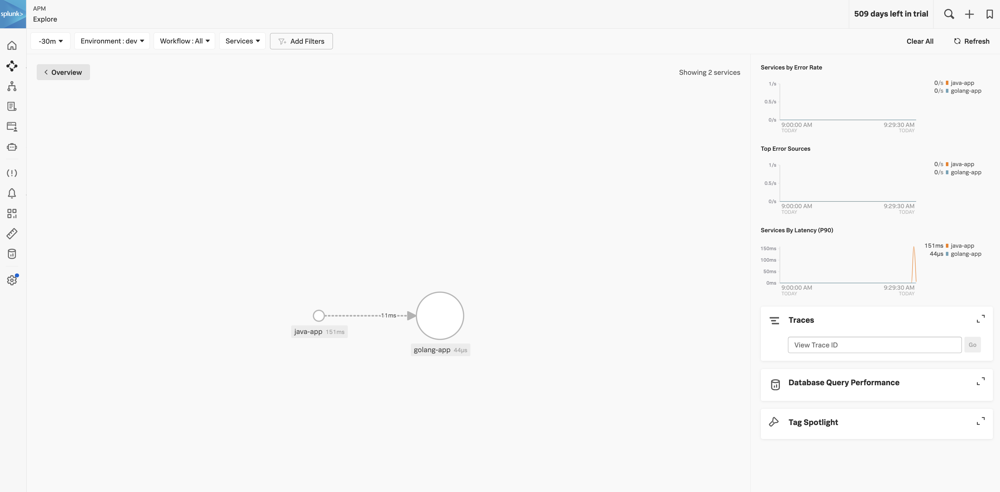
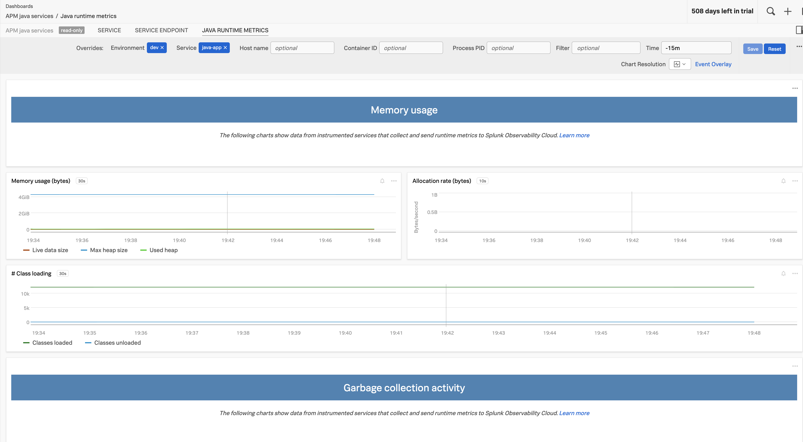

# Simple Microservice Observability Example

This example is for quick verification that traces from different microservice running on different programming languages will be propagated based on auto instrumentations.

The example has 2 microservice running on 
- Java
- Golang

The example is built for quick self reference hence no docker images has been created.


Do note that a OTEL collector is running in the background sending the traces to O11y
```text
faaab8fc9ff3   quay.io/signalfx/splunk-otel-collector:latest   "/otelcol --config=/…"   7 days ago   Up 16 hours   0.0.0.0:4317-4318->4317-4318/tcp, 0.0.0.0:6060->6060/tcp, 0.0.0.0:8006->8006/tcp, 0.0.0.0:8888->8888/tcp, 0.0.0.0:9080->9080/tcp, 0.0.0.0:9411->9411/tcp, 0.0.0.0:9943->9943/tcp, 0.0.0.0:13133->13133/tcp, 0.0.0.0:14250->14250/tcp, 0.0.0.0:14268->14268/tcp, 0.0.0.0:24224->24224/tcp, 9443/tcp   splunk-otel-collector
```

## Java Microservice

The java is the client invoking a call to the Golang microservice. Sample output

```text
➜  splunk-O11y-microservice curl localhost:8081/api/greeting
Spring Boot says: Hello from Go!%   
```

## Java configuration


### VM option
-javaagent:./splunk-O11y-java-microservice/splunk-otel-javaagent-all.jar

### Environment Variables
OTEL_SERVICE_NAME=java-app;OTEL_RESOURCE_ATTRIBUTES=deployment.environment=dev

---

## Golang Microservice



### Environment Variables
OTEL_SERVICE_NAME=java-app;OTEL_RESOURCE_ATTRIBUTES=deployment.environment=dev

## Output





## Enabling Java JVM Metrics


We need to enable `-Dsplunk.metrics.enabled=true ` to capture JVM metrics

`java -javaagent:./splunk-otel-javaagent-all.jar -Dsplunk.metrics.enabled=true -jar ./target/splunk-O11y-java-microservice-0.0.1-SNAPSHOT.jar`


